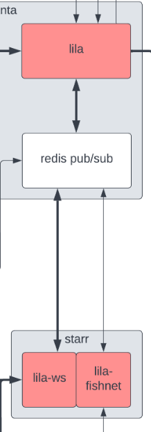
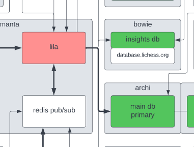

# Refactor with React
Currently, the project uses express handlebars for templating the different pages

Using a frontend framework with Phaser is a little challenging since Phaser also is a framework that runs in the frontend, but this  is something I would like to tackle

This would also add improved support for .env variables, currently, the solutions are hacky for example inline dom node store with information or the use of global variables

# Add ability to chat
Chat is the example project given for socket.io
https://socket.io/get-started/chat

Because users can leave and enter rooms without losing game data, in the same way the chat logs should persist. This is not something covered in the socket.io example

# Improved scalability

Lichess an open-source chess repo uses a pub/sub model to broadcast games to multiple clients at once with multiple servers

Implementing this natively in Redis could be done with the Redis adapter
https://socket.io/docs/v4/redis-adapter/

# Database

Redis was chosen as the database for handling games, as it ram base design allows for quick 
inserts, and quick feedback to clients. 

But it does come with many limitations
- for example, querying is not supported by default
- You are also limited in the  complexity of data to be stored
- actions like updating can be challenging
- limit on how much data can be stored

For a theoretical large board game site, it might not be reasonable to store all the game information in RAM, as this could cause more and more load on the servers.

With that said I have been looking into the possibility of syncing Redis to more of a traditional disk-based database, this would allow for example other users to get delayed info about a game. For up-to-date information, a user might spectate a game

Actions like accounts could be input to a disk-based database directly, but this would concern syncing real-time data from Redis from the games, themselves

## Write Behind
Redis offers the option of write-behind cache
"
Write-behind is a caching strategy in which the cache layer itself connects to the backing database. This means that your applications need only ever connect to your cache layer, and the cache then reads from or updates the backing database as needed"

## Queue 
I think another option might be to use a queue, and have that handle updates to the database
There are various queues  like RabbitMQ/bull

Redis can also be used as a message queue, so maybe it could also be used to serve a dual purpose here. 

### Lichess

This seems to be what this repo is doing partly 
According to this image

The server writes to a pub/sup to handle scaling, and also a main.db which is MongoDB

Previously every move was written to the database
https://searchcode.com/file/97895228/doc/mongodb.md/

However, according to this blog post moves are updated now in the database in intervals
https://lichess.org/blog/XgttDRAAAB8AmHcb/lichess-end-of-year-update-2019

#### Update
According to the developer, moves are stored in memory, and flushed at certain intervals or from events.

# Handling Disconnects

Client-to-server can handle disconnects, as socket.io will retry messages if the server has issues

However if the server tries to send a message to the client, and the connection has issues then the only way to fix this would be to reload the tab or window. This is a little user unfriendly so a better system would be to have the server retry these messages until it gets a confirmation from the client

Socket.io has a few built-in and external ways to provide this functionality

https://socket.io/docs/v4/tutorial/handling-disconnections
https://socket.io/docs/v4/tutorial/step-6
https://socket.io/docs/v4/tutorial/step-7

Socket.io does not store events, so the server has to be built in a way that limitation is bypassed. Or clients have be able to get up to date information from the server on reconnect

# Handling More Clients

Socket.io has various adapters that can help with horizontal scaling as the client load increases
For example, the cluster adapter bypasses the thread limitation of Node, by running multiple socket.io on multiple cpu threads

When a worker sends out a message, it sends this message to the clients connected to it. But also the other workers, so they can send it to their client.
Redis could work in a similar way with the pub/sub system. Instead this could be done with multiple servers to decrease load on each server

# Using Session ID
Even though local storage does not have expire date. There is no way to restore game data if the local storage is erased. It is also limited to a single machine, so for users with multiple computers, would have different games

If a user loses this unique socket.id information, then that game is lost. Unless an admin provides the information that the user needs to restore their game access

With a proper database, we could tie each game to two different userid, for each active player slot. Then we could match this userid via a session and authentication.  This information could then be used to pass the correct access to each user based on the userid, after logging in.

# Third Party spectators
The socket.io rooms are limited to two people at the moment, an improvement could be to allow additional no-players to receive updates and to spectate games

# Saving individual Moves
Currently, only the number of moves is saved, an improvement might be to save the individual moves
The location of a piece, and the final location

This could also allow for the game to show the previous moves that had been made

# Blocking Bots
Truly being effective against the use of bots or AI, would require some sort of heuristics to detect non-human behavior.
This is more of an advanced topic for me at the moment, but some of the simpler methods of prevention could simply be providing obstacles to less experienced users

## Code Obfuscation
One idea would be simply to run a tool like javascript-obfuscator as a webpack plugin. This could be a good way to validate the move as long as the code was unable to be decrypter by the user. It would also serve to make using a bot to send inputs harder

Another benefit is that this method is very easy to implement

Some downsides are that the size of the code would increase, and a knowledgeable user can reverse engineer the code
It might also make debugging harder 

## Move Obfuscation
https://incolumitas.com/2014/01/26/the-art-of-cheating-making-a-chess-com-chess-bot-using-a-unusual-approach/

This would be like code obfuscation, but it would instead target bots and cheaters at the point of entry
Without the ability to send moves, they lose almost all their efficiency

Based on the article above, there is also nothing stopping this method from being combined with code obfuscation, as an additional barrier
Though based on the contents of the article it may not be much of a barrier for someone determined

## Mouse Detection

Many captchas or anti-bot software today use mouse movements as a way to detect if someone is human

As long as this board game requires the use of the mouse to interact with the board, then something like this might be helpful in preventing computers from playing.
Since most likely these machines would try to input directly into socket functions directly rather than go through the normal process

# Additional Features
- Forfeit
- Ask for a draw
-Player Progress
- Indication that the other player is trying to make a move

- Computer Opponent
* This would be more advanced, but implementing a computer opponent
- Provide sessions for saving games
- implement threading or multiprocessor to improve performance
- add an indication of player status
- Password-protected rooms
