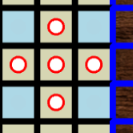
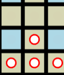

This files list previous limitations/issues fixes to this problems

# Update on Handling Player Switch 11/4/2023

Previously after the current player made a move. The game would set the current player to null, and the server would send the move to the other player. At one point the current player switch was handled by switching that value with a otherplayer value. So at that point having the the switch happen only once was very important as to not switch back to the same player. This was simplified to be controlled by the a move counter

Which mainly leave the issue of data synconization 

Which redis is able to solve, as soon as valid move is sent redis is updated. This also serves as the sourch of truth for a game, and is not something the end user can modfiy. If a user disconnects and has to rejoin the game, this is where they will pull information about what the board looks like, and which player is current.

## Issue
I've realized though that if a player disconnects then they would not receive the latest board until the reload the page, a better experience would be to implement some message guarnatee from the server. So that it will retry to send the data about the changes until the client accepts it. 

I believe socket.io loses messages from client to server on disconnect, so this would have to be implemented manually

# Server support 11/3/2023
Handling more clients could be improved by using cluster support
https://socket.io/docs/v4/tutorial/step-9

# Connection State Recovery  Info 11/2/2023
"
a Socket.IO client is not always connected
a Socket.IO server does not store any event
"
"
There is no such buffer on the server, which means that any event that was missed by a disconnected client will not be transmitted to that client upon reconnection
"
"
Even over a stable network, it is not possible to maintain a connection alive forever.
"

I've tried to simply the number of messages in this program, since it makes it easier to debug. It also makes it easier to track which messages are sent to which client

Having redis support should help in a lot of instances were messages may be lost

This could be an issue during the move confirmation stage, if the client loses the next move message the game could be in a standstill as the currentplayer will be set to null, and the message will not be reried

## Fix

Socket.io provides built in server to client recovery
https://socket.io/docs/v4/tutorial/handling-disconnections
https://socket.io/docs/v4/tutorial/step-6
https://socket.io/docs/v4/tutorial/step-7

# At Least Once vs Exactly Once 11/2/2023
https://socket.io/docs/v4/delivery-guarantees#at-least-once

It seems that the only places that might cause issue are toggle interactivey, I think it might be possible that the enableinteractvity message could be sent twice. This could be bad, because of course duplicating listeners can lead to issue. This could be fix on the client by removing the liseners before enabling them

sendmove could be troublesome too, the client is sent up to retry message after time out. So a possiblility is that the redis server could go out if this happens then of course the client would keep retrying, as they would never get the confirmation. 
The number of moves should stay the same no matter, I think the biggest issue is that repeating board moves or player set changes could cause issue. 
## Example
Move piece only 1 block

The code for handle updating the board won't block, even though the game internal board has been updating. 

And the piece is still valid after the move

This would might be fixed of course on reload, but it could lead to confusion for users

At least we know that events will be received in order
https://socket.io/docs/v4/delivery-guarantees

# something about the shutdown process/side effects like
# listeners and timeout

# talk about removing ready status, just send updates for switching players and interactivty passed on client seperated

Both player would then send a confirmation to the server to trigger a player switch

Previous version of the script had the current player make a request to switchplayer this was troublesome 
- because any player could send this message
- multiple messages could potentially having a undesirable effect

Now we use confirmation from both user having multiple messages won't matter as the value for one user will be set to true
Also as a additional safety, currentuser is based on the number moves

# env variables

This was fixed by using a inline script, I like this method a little bit more since it keeps the dom clean

<s>
The client side javascript server can't accept env variables for information like the socket.io server address
</s>

# Simplify messages
I was unable to find best practices for socket.io

So much of the implementation here was based on looking at other example online 
gess is not a popular game, so I looked at chess implementations

- https://github.com/fratorgano/SocketChess/blob/master/server.js

- https://medium.com/@nguyen10/build-a-real-time-chess-using-express-and-socket-io-part-1-get-started-with-express-generator-b089fae8f223

See gess.drawio.pdf
- We have room to manage messages from different games, through it is pretty easy most of the time to send messages to both clients seperately
- Instead of having 3-4 sever events for the init stage, we cut it down to about two 
* creating+joingame, 2 confirmations + interactivty toggle+playerswitch

- During the game instead of having 3-4 messages for switching players we cut it down to around  
* 2 secondplayer gets move, 2 confirmations + interactivty toggle+playerswitch

This was the initial plan for the program, but it has changed after testing
- previously the flow would be creategame, tell client game is created, client join game, tell client game has been join, client the requests data tell client data has been requested then the client starts the game. This was confusing/buggy and hard to debug so to improve

Now the creategame and joingame events happen in the same server handler, and once this happens the client receives the data from the same handler

- Previously the current player  would send a move to the non current player, then this client would make a request to switchplayer and then the server would send a confirmation to the current player. The other player would also be notified that they could move. We also had a special event to mark player1 as the initial player

Now we have the a client send the move to server which sends it to the other player
Both client send a confirmation, and once there are two confirmations the change happens within the same event, this also happens within the init stage of the game

toggleconfirmation is used to confirm which user has control of the board, and for switching players

# this.system.scene issue

This was a confusing issue to debug as it only happened within the event handler and the other properties seem to be fine.

It also only happened after removing scene, and reinitiating it 

## Fix
The fix was a little hidden in the documentation 
https://newdocs.phaser.io/docs/3.60.0/Phaser.Scenes.Events.DESTROY

"
You should destroy any resources that may be in use by your Scene in this event handler.
"

Reading the documentation a little closer it also states here that the the destroy event is sent when calling remove
https://newdocs.phaser.io/docs/3.60.0/Phaser.Scenes.SceneManager#remove

I'm listing the debugging process since I came to the same conclusion another way

- look at debugger the value was okay in the object but in the event handler the property was missing 
- It would be fine if I added a value like _scene, I took some time to look at the code as the scene was removed

* this.scene refers to a sceneplugin which interfaces with a scenemanger 
* scene plugin remove function just calls remove on scenemanager https://github.com/photonstorm/phaser/blob/v3.55.2/src/scene/ScenePlugin.js
 
* Nothing really interesting here other then call scene.sys.destroy https://github.com/photonstorm/phaser/blob/v3.55.2/src/scene/SceneManager.js
* some values set to null here https://github.com/photonstorm/phaser/blob/v3.55.2/src/scene/Systems.js 
* It also sends the destroy event

- I also notice that the gameobjects don't seem to be removed they are just removed from the screen
- The event handlers might be a closure according to this, https://stackoverflow.com/questions/19655783/understanding-javascript-closure-with-event-handlers
- I play around with the variables and confirm that the the gameobjects in the event handler are probably the ones that were previous there, and not the ones from the reinitiated scene
- so in the end I need to cleanup all my changes after the scene is destroyed

# Small Hit Zones
This was fixed with two changes

1. Phaser when setting an object as interactive sets a square around that object by default to handle input, but you can modify
this object. I modified the object to try to take the entire square a piece is in or most of it. This way it is easier to grab the piece, even if it center is hidden
2. Taking inspiration from fps, the piece is shrunk while mouse is held down on it making it easier to target the correct drop zone.
We also have some convience features like highlighting of start and end zones to make it easier to keep track of movement
<s>
Drop zone for pieces can be very small
Hit zone can be very small, this is also troublesome because some pieces are hidden so getting the right area for a nine square piece can be hard
</s>

# Redis Changes

1. We can save player1 and player2 id, but we have to keep socket.id constant
2. userData is no longer sync between socket, so at certain points calling to redis to get latest data is important
3. redis supports hashes, but I was unable to find a way to get the entire dictionary back. So instead we are use JSON module
4. We have a set to keep track of which games are already created

# Better Support of Disconnect
This was fixed with redis and hardcoded socket.id to games

Which allows for us to use matching socket.id to match playernumber

<s>
A player could switch the playernumber, and take over for another player
- socket id change every connection
- we are trusting the localdata for restoring which player is which
</s>

# Socket ID
This was fixed by following guide to generate socket.sid

We have to use middleware to generate socket.id
since 3.0 

https://github.com/socketio/socket.io/discussions/4190
<s>
Redis Now saves the playerid, but this causes issue on re-entry since by default socket.io gets a new ID
</s>

# Incognito
Currently the socket.id is saved to localdata
If a user uses incognito and closes the browser, the game will no longer be accecible to them since the won't have a matching socket.id and a new one will be geneerated

## Fix
Probably need some sort of account system to tie a socket id to allow for restoration of games

# Cheating 

With the current implementation it is possible that the user could change the input to the socket, and present a invalid move

After some research, I found that there may be a few ways to meditate this 

## Update

I decided to go with server base confirmation
snapshot-interpolation is very interesting, but I think it is very cool, but I think it is overkill
for a board game

Once the cache system is made the steps for making a move will be
- The server cache system for the game will serve as source of truth
- user sends the move to the server and the server checks if move is legal, before updating or rejecting
- the second user does not receive the move until it is accepted
- Once both users confirm the move the game will switch players

<s>
## Code Obfuscation
One idea would be simply to run a tool like javascript-obfuscator as a webpack plugin. This would make the code unreadable to humans, and thus increase the difficulty of cheating
### Upsides
- relatively easy to implement
- good effectiveness

### Downsides
- The code is still client side
- As stated on the FAQ it could still be possible to reverse engineer
https://obfuscator.io/
- The size of the files will increase

## snapshot-interpolation
https://www.gabrielgambetta.com/client-server-game-architecture.html

We can use this to have the server send snapshots of the game state to users, via the inputs that the users send to the server

This is a good example of how the system
works

https://github.com/geckosio/phaser-on-nodejs-example

- on the server the phraser instance creates a map of all players 
- The server add a entry from the socket.id on new client connection
- the server sends snapshots at about 30 fps with the current state of the game, which ends up being where the dude character should be
- The client registers the current state of the movement, and sends this via socket to the server

- on disconnect, we destroy the dude object and remove the character

This would probably be the most effective method as it would change the server from being stateless, to holding the entire game state.

For example this could be used to have the server keep track of where each piece should be

We also don't have physics or other complexities in this game

## Upsides
- most of the code could be hidden from the client
- great effectiveness against cheating

## Downsides
- requires rewrite
- increase debugging difficulty
- increased load on server
- client needs to get updates from server

## Move Obfuscation
https://incolumitas.com/2014/01/26/the-art-of-cheating-making-a-chess-com-chess-bot-using-a-unusual-approach/
</s>

